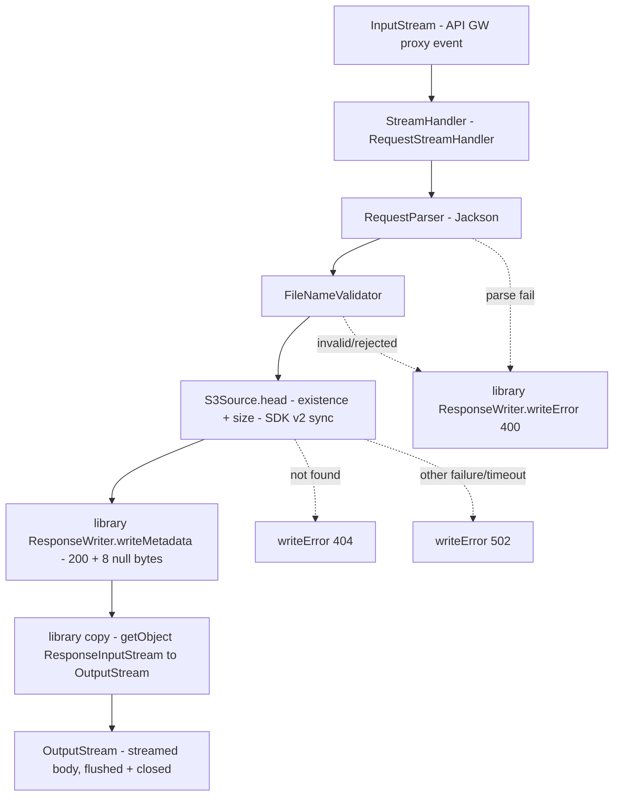
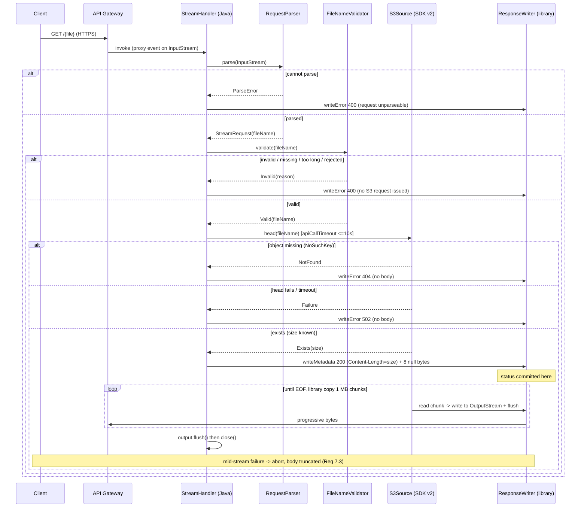

# Design Document

## Overview

This design adds a second, **Java** example — `streaming-s3-example-java` — that proves the published `aws-lambda-streaming-core` library works from **plain Java** on an AWS Lambda behind API Gateway response streaming. It is a one-for-one Java port of the existing Kotlin `streaming-s3-example`: a single Java Lambda accepts a GET request naming a file, confirms the object in S3, and streams its bytes back through API Gateway response streaming without ever holding the whole object in memory.

The purpose is **cross-language verification**. The same library artifact the Kotlin example consumes (`ResponseWriter`, `ResponseMetadata` + `fromMultiValue`, and the top-level `copy(...)`) is driven here from Java source. Because the example is idiomatic Java, it uses the **AWS SDK for Java v2** (`software.amazon.awssdk:s3`, synchronous) instead of the coroutine-based Kotlin SDK — so the Java handler is straight-line blocking code with no `runBlocking`/`suspend`.

"Done" is proven exactly as for the Kotlin example, across three layers plus the pipeline:
- unit + property tests (JVM, no network),
- TestContainers + LocalStack integration (real AWS SDK v2 against a containerized S3),
- a **real** OIDC-authenticated `sam deploy` of a separate Java stack, followed by the same streaming test that the Kotlin pipeline runs against the live endpoint.

Every Java-from-Kotlin interop friction found while building this is recorded in `docs/log.md` and feeds the article — the interop story is itself a deliverable.

### Design Goals (traceability to requirements)

- Consume the library's `ResponseWriter`, `ResponseMetadata`, and `copy(...)` from Java, reimplementing none of the wire format (Req 1, 5, 6).
- Parse + validate the requested file name safely (Req 2, 3).
- Confirm object existence/size *before* committing the status (Req 4).
- Stream through the library's bounded buffer with per-chunk flush and byte-identical output (Req 6).
- Prove delivery beyond the 6 MB limit (Req 7) and against a deployed endpoint (Req 10).
- Apply the same cold-start optimizations: SnapStart + CRaC priming + tiered compilation + arm64/Java 25 (Req 8).
- Configure API Gateway for response streaming (Req 9) with least-privilege, encrypted, cost-bounded infra (Req 11, 12).
- Match the Kotlin layered test strategy (Req 13), wire the module into CI build/coverage/validate (Req 15), perform a real OIDC deploy (Req 16), and run the same pipeline streaming test against the live Java endpoint (Req 17).
- Capture development knowledge, including interop friction, in `docs/log.md` (Req 14).

### Key Design Decisions

| Decision | Rationale | Requirements |
|---|---|---|
| New Gradle module `streaming-s3-example-java`, Java-only sources under `src/main/java` | Keeps the Kotlin example untouched; proves Java consumption in isolation. | 1.1, 15.5 |
| **AWS SDK for Java v2** (`software.amazon.awssdk:s3`), synchronous client | The Kotlin SDK is `suspend`-based and hostile to call from Java; SDK v2 sync is idiomatic Java and removes coroutines entirely. Deliberate, scoped deviation from `tech.md` (which mandates the Kotlin SDK for the Kotlin module). | 4, 6 |
| Drive `ResponseWriter` / `ResponseMetadata` / `copy(...)` from Java; reimplement nothing | This is the whole point — verify the library's Java-callability. | 1.2, 1.3, 1.4, 5.1 |
| Distinct package `nl.vintik.streaming.java` (not the library's `nl.vintik.lambda.streaming`) | Avoids a split package across two jars; keeps the Java example's types clearly separate from the library. | 1.1 |
| Constructor injection (overloaded ctors), not Kotlin delegates | Java has no `by lazy`/delegated properties; a public default ctor wiring real collaborators plus a package-private ctor taking collaborators keeps it testable. Scoped deviation from `tech.md` DI rule (Kotlin-specific). | 1, testability |
| Java `record` + `sealed interface` for the domain/outcome types | Java 25 supports records, sealed types, and pattern-matching `switch`, giving the same exhaustive, deterministic mapping the Kotlin sealed types provide. | 2, 3, 4 |
| **Jackson** for request parsing (`pathParameters.proxy`) | kotlinx-serialization is Kotlin-first; Jackson is the idiomatic Java JSON reader. The library still owns response serialization (kotlinx internally). | 2.1, 2.3 |
| **Mockito** for mocking, **JUnit Jupiter** for tests | MockK is Kotlin-only; Mockito is the Java standard. JUnit Jupiter matches the repo. | 13.1 |
| Separate SAM stack `java-s3-file-streaming-endpoint` under `deployment/aws/sam-java/` | A second function needs its own template/config/scripts; a separate stack keeps the Kotlin deployment isolated and independently teardown-able. | 9, 16 |
| Fat jar named `streaming-endpoint-java.jar` | Must not overwrite the Kotlin `streaming-endpoint.jar` in `build/dist/`. | 15.5 |
| Extend the **reusable** GHA workflows via a stack matrix (Kotlin + Java) | DRY: one deploy workflow and one streaming-test workflow parameterized by stack, invoked once per example. | 15, 16, 17 |
| Widen the OIDC role + CFN execution role to the Java stack's name/bucket/log-group | The real deploy is unauthorized otherwise; done without new wildcards beyond the existing pattern. | 16.3 |
| **Kover** on the Java module too (bytecode-level), 80% gate | Keeps a single coverage tool and `koverVerify` task name across the repo; Kover instruments compiled bytecode regardless of source language. JaCoCo is the fallback if Kover on a pure-Java module misbehaves (Dev_Log candidate). | 13.3, 15.2 |

## Architecture

### System Context

```mermaid
flowchart LR
    Client[HTTP Client] -->|GET /{file} over HTTPS| APIGW[API Gateway REST API - proxy integration - ResponseTransferMode RESPONSE_STREAM]
    APIGW -->|streamed invoke| Lambda[Java Lambda - RequestStreamHandler]
    Lambda -->|library ResponseWriter + copy| Lib[[aws-lambda-streaming-core]]
    Lambda -->|headObject / getObject - s3:GetObject only - AWS SDK for Java v2| S3[(S3 Bucket - SSE + Block Public Access - lifecycle expiry)]
    Lambda -->|logs, finite retention| CW[(CloudWatch Logs)]
```

Identical topology to the Kotlin example; the only substantive difference is that the handler is Java and the S3 calls go through the AWS SDK for Java v2. The wire protocol and bounded copy come from the shared library.

### Internal Component Flow



### Request / Response Sequence



## Consuming the library from Java (the novel part)

The library is Kotlin, compiled for Java 21. Its public surface is plain (no `suspend`), so Java can call it — but three Kotlin idioms surface as friction. Each is called through a Java-compatible entry point and recorded in the Dev_Log (Req 1.5, 14).

| Kotlin API | Java call site | Friction / note |
|---|---|---|
| `ResponseWriter()` (no-arg) | `new ResponseWriter()` | Clean. |
| `ResponseWriter(json = …, maxPreludeLen = OBSERVED_MAX_PRELUDE_LEN)` (default params) | `new ResponseWriter(Json.Default, ResponseWriterKt.OBSERVED_MAX_PRELUDE_LEN)` | Java can't use Kotlin default args, so it must pass `kotlinx.serialization.json.Json.Default` explicitly and read the constant off the generated `ResponseWriterKt` facade. **Candidate library improvement:** a Java-friendly `ResponseWriter(int maxPreludeLen)` overload. |
| top-level `copy(source, sink, flush = { sink.flush() })` | `BoundedBufferKt.copy(source, output)` | The 2-arg overload defaults `flush` to flushing the sink — exactly what we want — so Java avoids constructing a Kotlin `Function0`. Use the 2-arg form. |
| `ResponseMetadata(statusCode, headers, cookies = null)` | `new ResponseMetadata(200, headers, null)` | Cookies default is unavailable from Java; pass `null` explicitly. |
| `ResponseMetadata.fromMultiValue(status, headers)` (companion) | `ResponseMetadata.Companion.fromMultiValue(status, headers)` | Companion method reached via `.Companion`. |
| `OBSERVED_MAX_PRELUDE_LEN`, `DELIMITER_LEN` (top-level consts) | `ResponseWriterKt.OBSERVED_MAX_PRELUDE_LEN` | Top-level Kotlin members live on the `*Kt` facade class. |

The Java handler uses `new ResponseWriter(Json.Default, ResponseWriterKt.OBSERVED_MAX_PRELUDE_LEN)` (matching how MockNest constructs it) so the oversized-prelude fail-fast is exercised from Java as well.

## Components and Interfaces

Package root: `nl.vintik.streaming.java`. Each concern is a separate class so it is independently testable (mirrors the Kotlin example, `structure.md`).

### StreamHandler

Implements `com.amazonaws.services.lambda.runtime.RequestStreamHandler`. Orchestrates parse → validate → head → write, owns the status mapping, and drives the library. Synchronous (no coroutines).

```java
public final class StreamHandler implements RequestStreamHandler {
    private final RequestParser parser;
    private final FileNameValidator validator;
    private final S3Source source;
    private final ResponseWriter writer;

    public StreamHandler() { /* wire real collaborators */ }
    StreamHandler(RequestParser p, FileNameValidator v, S3Source s, ResponseWriter w) { /* for tests */ }

    @Override
    public void handleRequest(InputStream input, OutputStream output, Context context) throws IOException {
        try (output) {                     // flush+close on every exit path (Req 5.5)
            ParseResult parsed = parser.parse(input);
            if (parsed instanceof ParseResult.ParseError) {
                writer.writeError(output, 400, "The request could not be parsed.");
            } else {
                handleValidated(((ParseResult.Parsed) parsed).request(), output);
            }
            output.flush();
        }
    }
    // handleValidated: validate -> map Invalid reasons to 400 (no S3 call);
    //                  head -> NotFound=404, Failure=502, Exists=stream 200.
}
```

- Uses pattern-matching `switch` over the sealed `ValidationResult` / `HeadResult` for exhaustive, deterministic mapping.
- Guarantees no body bytes on any pre-commit error path; after `writeMetadata` returns, only body truncation is possible (Req 5.3, 7.3).
- `try (output) { … output.flush(); }` flushes then closes the Lambda output stream — the fix already learned in `docs/log.md` for warm-invocation truncation (Req 5.5).

### RequestParser

Parses the API Gateway proxy event from the `InputStream` into `StreamRequest`, extracting only `pathParameters.proxy` and tolerating the full proxy-event shape.

```java
public final class RequestParser {
    private final ObjectMapper mapper; // FAIL_ON_UNKNOWN_PROPERTIES = false
    public ParseResult parse(InputStream input); // Parsed(StreamRequest) | ParseError
}
```

- Reads the tree, lifts `/pathParameters/proxy` (empty string when absent — left for the validator), returns `ParseError` only when the JSON cannot be decoded (Req 2.1, 2.3).

### FileNameValidator

Pure function, no I/O. Same allow-list and ordered rejection reasons as the Kotlin validator (Req 3.1–3.6):

```java
public final class FileNameValidator {
    public ValidationResult validate(String fileName);
}
```

Order (first applicable, most specific reason): `MISSING` (null/blank) → `TOO_LONG` (>1024) → `ABSOLUTE_PATH` (leading `/`, `\`, or `X:`) → `PATH_SEPARATOR` (`/` or `\`) → `PARENT_DIR` (`..`) → `ILLEGAL_CHARACTER` (outside `A–Z a–z 0–9 - _ .`). On rejection the handler writes 400 and issues no S3 request (Req 3.7).

### S3Source

Wraps the AWS SDK for Java v2 synchronous `S3Client`. Two concerns: confirm existence/size, then open and copy the body via the library's `copy`.

```java
public final class S3Source {
    private final String bucket;   // from BUCKET_NAME env var, never logged
    private final S3Client client; // default chain (region/creds from env)

    public HeadResult head(FileRequest request);                       // Exists(size)|NotFound|Failure
    public long streamBody(FileRequest request, OutputStream sink) throws IOException;
}
```

- `head`: `client.headObject(b -> b.bucket(bucket).key(key).overrideConfiguration(o -> o.apiCallTimeout(Duration.ofSeconds(10))))`. Catch `NoSuchKeyException` → `NotFound`; `ApiCallTimeoutException` and any other exception → `Failure(cause)` (Req 4.1, 4.2, 4.4). Return `Exists(response.contentLength())`.
- `streamBody`: `try (ResponseInputStream<GetObjectResponse> in = client.getObject(get)) { return BoundedBufferKt.copy(in, sink); }` — the SDK v2 `ResponseInputStream` is `Closeable`, so try-with-resources releases it on success and failure; the library's `copy` flushes per chunk (Req 6.1, 6.4, 6.6). No full-object buffering (Req 6.3).

### Priming (CRaC)

Java `org.crac.Resource` registered in its constructor; `beforeCheckpoint` exercises S3 client init, one handler invocation against a primed proxy event, and metadata serialization through the library — in one pass, no error handling so failures fail the snapshot (Req 8.2, 8.3).

```java
public final class Priming implements Resource {
    public Priming() { Core.getGlobalContext().register(this); }
    @Override public void beforeCheckpoint(org.crac.Context<? extends Resource> c) {
        new S3Source();                                                   // 1. client init
        new StreamHandler().handleRequest(primedEvent(), OutputStream.nullOutputStream(), PRIMING_CONTEXT); // 2.
        new ResponseWriter().writeMetadata(OutputStream.nullOutputStream(), PRIMED_METADATA);               // 3.
    }
    @Override public void afterRestore(org.crac.Context<? extends Resource> c) { }
}
```

A minimal no-op `Context` implementation (`PRIMING_CONTEXT`) backs the primed invocation, mirroring the Kotlin `PrimingContext`.

## Data Models

Java records and sealed interfaces (Java 25):

```java
public record FileRequest(String fileName) {}
public record StreamRequest(String fileName) {}

public sealed interface ParseResult {
    record Parsed(StreamRequest request) implements ParseResult {}
    record ParseError() implements ParseResult {}         // singleton-ish marker
}

public sealed interface ValidationResult {
    record Valid(String fileName) implements ValidationResult {}
    record Invalid(Reason reason) implements ValidationResult {}
    enum Reason { MISSING, TOO_LONG, ILLEGAL_CHARACTER, PATH_SEPARATOR, PARENT_DIR, ABSOLUTE_PATH }
}

public sealed interface HeadResult {
    record Exists(long size) implements HeadResult {}     // size >= 0 (validated in compact ctor)
    record NotFound() implements HeadResult {}
    record Failure(Throwable cause) implements HeadResult {}
}
```

`ResponseMetadata` and `ErrorBody` are **not** redefined — they come from the library. Successful responses use `new ResponseMetadata(200, Map.of("Content-Type","application/octet-stream","Content-Length", String.valueOf(size)), null)`.

## Correctness Properties

The same five universal properties as the Kotlin spec, each implemented as one `@ParameterizedTest` (10–20 `@MethodSource`/`@ValueSource` cases). Tag strings use `Feature: java-s3-file-streaming-endpoint, Property N: …`.

### Property 1: Metadata round-trip preserves status and all headers
*For all* `ResponseMetadata` values `m` built from Java (arbitrary status codes; header maps including multi-value collapsed via `fromMultiValue`; cookies present/absent), decoding the JSON the library's `ResponseWriter` produces reproduces the status and every header. Because the Java module builds metadata through the library, this asserts the library round-trips correctly under Java-constructed inputs.
**Validates: Requirements 1.3, 5.1, 5.2**

### Property 2: Streaming output is byte-identical to the source
*For all* source byte sequences across boundary sizes (0, < 1 MB, exactly 1 MB, multiples, non-aligned), the bytes written to the sink by `S3Source.streamBody` (driving the library's `copy`) are byte-identical to the source, and the sink is flushed at least once per chunk plus a final flush.
**Validates: Requirements 1.4, 6.1, 6.4, 6.5**

### Property 3: Transfer memory is bounded independent of object size
*For all* object sizes (small, ~6 MB, ~15 MB and beyond), no single `String`/`byte[]` holding the whole body is allocated; peak transfer memory stays at the library's fixed buffer plus fixed overhead. Verified with an instrumented sink/source and the library's `copy`.
**Validates: Requirements 6.2, 6.3**

### Property 4: File-name validation accepts exactly the safe set and never reaches S3 when rejecting
*For all* strings, `FileNameValidator` accepts iff the string is allow-list-only, has no separator/`..`/absolute prefix, is non-blank, and ≤ 1024; and *for all* rejected strings the `StreamHandler` writes 400 and issues **zero** S3 calls (verified against a Mockito mock with `verifyNoInteractions`).
**Validates: Requirements 2.2, 2.4, 3.1, 3.2, 3.3, 3.4, 3.5, 3.6, 3.7**

### Property 5: Status is committed exactly once; failures never rewrite it
*For all* failure-injection points, existence/size is confirmed before metadata is written; pre-commit failures (parse, validation, NotFound, head Failure/timeout, write failure during metadata/delimiter) write **no** body and the mapped status (400/404/502); post-commit failures (source/sink throwing mid-stream) only **truncate** the body, leave the committed status byte-prefix unchanged, release the S3 stream, and propagate.
**Validates: Requirements 2.2, 2.3, 4.1, 4.2, 4.3, 4.4, 5.3, 5.4, 6.6, 7.3**

## Error Handling

Same **status-committed-early** principle: every outcome-changing check runs before `writeMetadata`. Up to commit, failures produce a metadata-only error response via `ResponseWriter.writeError`; after commit, only body truncation is possible.

| Failure | Committed status | Body guarantee | Component | Requirements |
|---|---|---|---|---|
| Proxy event cannot be parsed | 400 | No body; JSON error | RequestParser → StreamHandler | 2.3 |
| File name missing / whitespace | 400 | No body | FileNameValidator → StreamHandler | 2.2, 3.5 |
| File name > 1024 | 400 | No body | FileNameValidator → StreamHandler | 2.4, 3.6 |
| Illegal name (allow-list/separator/`..`/absolute) | 400 | No body; **no S3 request** | FileNameValidator → StreamHandler | 3.1–3.4, 3.7 |
| S3 object missing (`NoSuchKeyException`) | 404 | No body | S3Source → StreamHandler | 4.2 |
| `head` fails (other) or `ApiCallTimeoutException` (>10 s) | 502 | No body | S3Source → StreamHandler | 4.1, 4.4 |
| Write fails **before** metadata+delimiter complete | propagate (uncommitted) | No body | ResponseWriter (library) | 5.4 |
| Write fails **after** metadata+delimiter (post-commit) | unchanged (200) | Body truncated; propagate | StreamHandler / library | 5.3, 7.3 |
| Read/write fails mid-stream (post-commit) | unchanged (200) | Copy stops, `ResponseInputStream` released via try-with-resources, propagate | S3Source (library `copy`) | 6.6, 7.3 |

Conventions: single SDK calls guarded with try/catch mapping to the sealed `HeadResult`; the S3 `ResponseInputStream` wrapped in try-with-resources (Req 6.6). Failures logged at WARN (expected: not-found, validation, timeout) / ERROR (write failures) via SLF4J — bucket names/keys never logged. `Priming.beforeCheckpoint` never catches, so a bad primed path fails the snapshot (Req 8.3). HTTPS enforcement / plain-HTTP rejection are at the API Gateway layer (Req 11.4, 11.5).

## Deployment / Infrastructure (SAM)

A **separate** stack `java-s3-file-streaming-endpoint`, under `deployment/aws/sam-java/`, mirroring `deployment/aws/sam/`:

```
deployment/aws/sam-java/
  template.yaml        # Globals java25/arm64; Fn Handler nl.vintik.streaming.java.StreamHandler;
                       #   CodeUri build/dist/streaming-endpoint-java.jar; AutoPublishAlias live;
                       #   SnapStart PublishedVersions; JAVA_TOOL_OPTIONS L1 tiered;
                       #   Api GET /{proxy+} RESPONSE_STREAM; s3:GetObject-only role;
                       #   SSE + 4x Block Public Access + lifecycle expiry; log retention 1-30d
  samconfig.toml       # stack_name = java-s3-file-streaming-endpoint
  build.sh             # ./gradlew clean :streaming-s3-example-java:build  (-> streaming-endpoint-java.jar)
  deploy.sh            # build.sh + sam build + sam deploy
```

The template is structurally identical to the Kotlin one (same parameters, SnapStart, scoped IAM, SSE, BPA, lifecycle, log retention, no provisioned concurrency). Only the `Handler`, `CodeUri`, `FunctionName`, and description differ. Outputs match the Kotlin names (`StreamingEndpointUrl`, `FunctionName`, `SourceBucketName`, `ApiKeyId`) so the shared scripts resolve them.

The Java module's `build.gradle.kts` applies the Shadow plugin with `archiveFileName = "streaming-endpoint-java.jar"` into `build/dist/` (Req 15.5).

### IAM / OIDC changes (Req 16.3)

`deployment/aws/oidc/github-oidc-role.yaml` is widened so the GitHub Actions role can deploy and test the Java stack, without new wildcards beyond the existing pattern:
- streaming-test S3 access: add `arn:aws:s3:::java-s3-file-streaming-endpoint-*` (+ `/*`).
- CloudWatch Logs read: add `/aws/lambda/java-s3-file-streaming-endpoint*`.
- API key read (`apigateway:GET /apikeys/*`) already covers the Java API key.
- CloudFormation actions are already `Resource: '*'` (stack name agnostic).
The CFN execution role's `lambda:*`/`apigateway:*`/`s3:*`/`logs:*` scopes already match `*`/region-wide, so they cover the Java stack unchanged.

## CI/CD and real-deploy design

The existing three reusable workflows are extended so both examples flow through one pipeline. Entry points (`ci-feature-build.yml` on `feature/**`, `cd-deploy-on-demand.yml` on demand) keep the same `test → deploy → streaming-tests` ordering (Req 17.8).

**`workflow-build.yml` (build/coverage/validate):** add the Java module to the test job and validate its template (Req 15):
```
./gradlew :streaming-core:test koverVerify \
          :streaming-s3-example:test -PexcludeTags=integration \
          :streaming-s3-example-java:test :streaming-s3-example-java:koverVerify -PexcludeTags=integration
sam validate --template-file deployment/aws/sam/template.yaml
sam validate --template-file deployment/aws/sam-java/template.yaml
```
Both examples are always built and validated (Req 15.4).

**`workflow-deploy-aws.yml` and `workflow-streaming-test.yml` (parameterized):** add inputs so one workflow targets either stack — `sam-dir` (default `deployment/aws/sam`), `stack-name` (default `s3-file-streaming-endpoint`), `build-task` (default `clean build`), `jar-name` (default `streaming-endpoint.jar`), and `test-script` (default `scripts/pipeline-streaming-test.sh`). Existing behavior is preserved by the defaults.

Entry-point workflows invoke the deploy and streaming-test reusable workflows twice via a **stack matrix**, once per example:
```yaml
deploy:
  needs: test
  strategy:
    matrix:
      include:
        - { sam-dir: deployment/aws/sam,      stack-name: s3-file-streaming-endpoint,      build-task: ":streaming-s3-example:build",      jar-name: streaming-endpoint.jar }
        - { sam-dir: deployment/aws/sam-java, stack-name: java-s3-file-streaming-endpoint, build-task: ":streaming-s3-example-java:build", jar-name: streaming-endpoint-java.jar }
  uses: ./.github/workflows/workflow-deploy-aws.yml
  with:
    sam-dir: ${{ matrix.sam-dir }}
    stack-name: ${{ matrix.stack-name }}
    build-task: ${{ matrix.build-task }}
    jar-name: ${{ matrix.jar-name }}
    github-actions-role-name: ${{ vars.OIDC_ROLE_NAME }}
  secrets: { AWS_ACCOUNT_ID: ${{ secrets.AWS_ACCOUNT_ID }} }

streaming-tests:
  needs: deploy
  strategy:
    matrix:
      include:
        - { stack-name: s3-file-streaming-endpoint,      test-script: scripts/pipeline-streaming-test.sh }
        - { stack-name: java-s3-file-streaming-endpoint, test-script: scripts/pipeline-streaming-test.sh }
  uses: ./.github/workflows/workflow-streaming-test.yml
  with:
    stack-name: ${{ matrix.stack-name }}
    test-script: ${{ matrix.test-script }}
  secrets: { AWS_ACCOUNT_ID: ${{ secrets.AWS_ACCOUNT_ID }} }
```

The Java deploy uses OIDC assume-role, the shared SAM artifacts bucket, and the CFN execution role — identical mechanics to the Kotlin deploy (Req 16.1, 16.2). The streaming test reuses the **same** `scripts/pipeline-streaming-test.sh`, which is already fully parameterized by `STACK_NAME`/`ENDPOINT_URL`/`BUCKET_NAME`/`TEST_OBJECT_KEY` — so the Java pipeline test is literally the Kotlin script pointed at the Java stack (Req 17.7). A distinct `TEST_OBJECT_KEY` (e.g. `streaming-test-12mb-java.bin`) keeps the Java object separate.

If deploy fails (other than "no changes"), the streaming-test stage does not run because it `needs: deploy` (Req 16.5).

### Local scripts

- `deployment/aws/sam-java/{build.sh,deploy.sh}` for manual build/deploy.
- The existing `scripts/post-deploy-test.sh` and `scripts/pipeline-streaming-test.sh` are reused for the Java stack by setting `STACK_NAME=java-s3-file-streaming-endpoint` (and a Java object key). Both already resolve everything from stack outputs, so no Java-specific copies are needed (Req 10, 17.7).

## Testing Strategy

Mirrors the Kotlin layered approach.

### Layer (a) — Unit + property tests (JVM, no network)
JUnit Jupiter (`useJUnitPlatform()`), **Mockito** (`mock(...)`, `verifyNoInteractions(...)`), `@ParameterizedTest` for the five properties (10–20 cases each), Given-When-Then test names. Larger fixtures in `src/test/resources/test-data/`. Example/edge tests complement the properties: `RequestParser` (proxy events, malformed/empty/truncated → `ParseError`), `StreamHandler` branch mapping (NotFound→404, Failure/timeout→502, Exists→200 with `Content-Length` before body, head-before-metadata order), and `Priming` (touches all three paths in one pass; a throwing primed path propagates).

Java 25 + Mockito needs the inline mock maker on a current Byte Buddy; the same class-file-version issue seen with MockK (`docs/log.md`) may require a recent Mockito and/or `-Dnet.bytebuddy.experimental=true` — a Dev_Log candidate (Req 14).

### Layer (b) — Integration tests (TestContainers + LocalStack S3)
Real AWS SDK for Java v2 calls against a containerized S3. One LocalStack container shared via `@BeforeAll`/`@AfterAll` with `Wait.forHttp("/_localstack/health").forStatusCode(200)`; clean only object data between tests (`tech.md`, Colima runtime). Cases: a sub-6 MB object streamed end-to-end (byte-identical), and a ~15 MB `Test_Object` (HTTP 200, received size == stored size, byte-identical) proving delivery past the 6 MB limit (Req 13.2, 7.1, 7.2). Tagged `integration` so unit/property tests run without a container (Req 13.4).

### Layer (c) — Real deploy + pipeline/post-deploy verification
The CI pipeline performs the real OIDC deploy and runs `scripts/pipeline-streaming-test.sh` against the live Java endpoint (Req 16, 17). Locally, `scripts/post-deploy-test.sh` with `STACK_NAME=java-s3-file-streaming-endpoint` proves all of Req 10 (≥15 MB full byte-identical delivery, warmup-excluded TTFB < 50%, memory within 10% of the 6 MB baseline, teardown).

### Coverage gate
**Kover** `koverVerify` at 80% for the Java module (matching the Kotlin example), run in CI (Req 13.3, 15.2). Fallback to JaCoCo if Kover on a pure-Java module proves problematic (Dev_Log candidate).

### Infrastructure / configuration checks
`sam validate` on `deployment/aws/sam-java/template.yaml` (exit 0 before commit, Req 9.4/9.5) plus template assertions: `ResponseTransferMode: RESPONSE_STREAM` (never `STREAM`), SnapStart `live` + `PublishedVersions`, `arm64`/`java25` from `Globals`, `JAVA_TOOL_OPTIONS` L1 tiered, `s3:GetObject`-only scoped IAM, SSE, four Block Public Access flags, finite log retention, bounded memory/timeout, no provisioned concurrency, lifecycle expiry.
