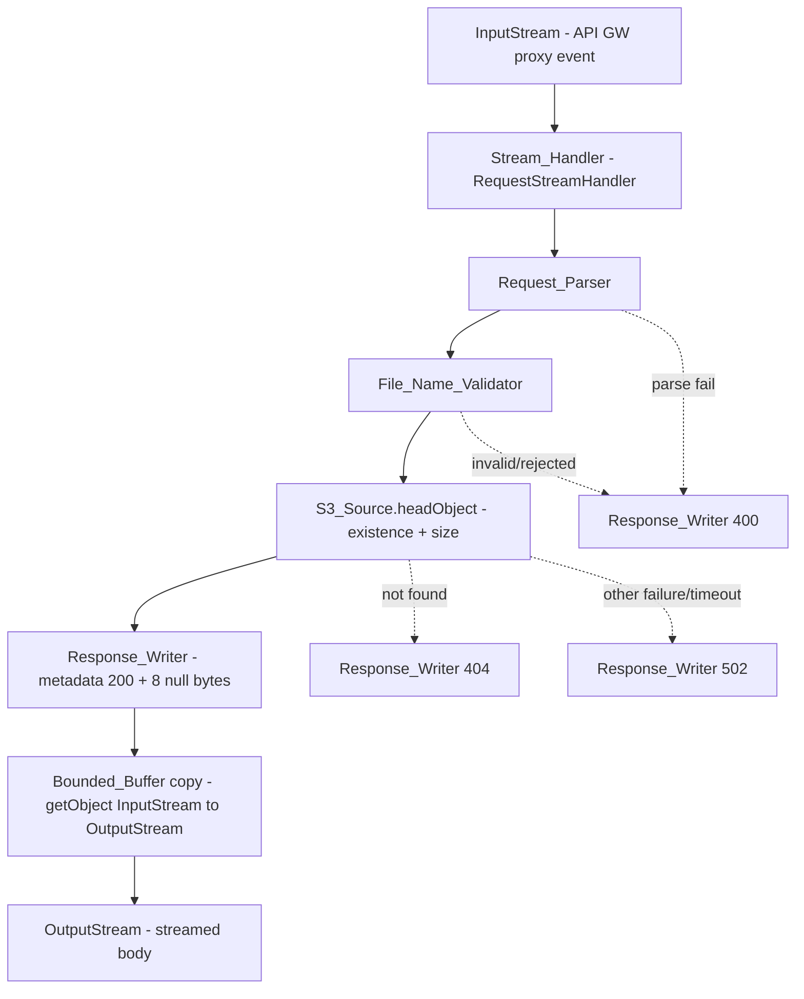
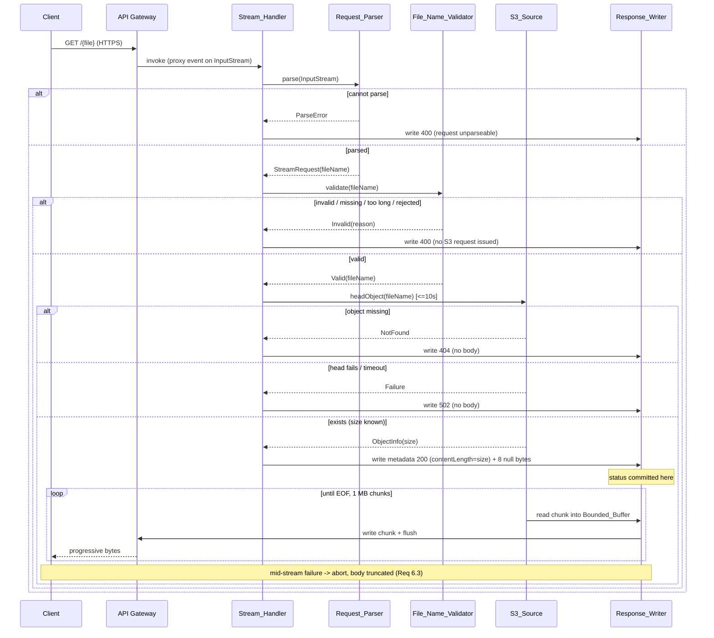
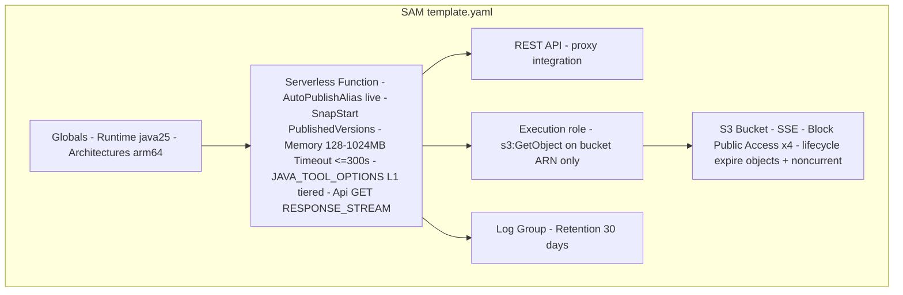

# Design Document

## Overview

This design describes a minimal, single-module Kotlin/JVM AWS Lambda that streams a large (~15 MB) object from Amazon S3 to an HTTP client through API Gateway response streaming, without ever holding the whole object in memory. It is the simplified, non-mock counterpart of the streaming mechanism in MockNest Serverless: same project setup, coding standards, and cold-start optimizations, collapsed to one Gradle module with no business logic.

The core problem: AWS's response-streaming helpers (`awslambda.HttpResponseStream.from()`) are Node.js-only. On the JVM there is no helper, so the API Gateway streaming response wire format — a metadata JSON document, then 8 null bytes as a delimiter, then the raw body bytes — must be written by hand from a `RequestStreamHandler`. The handler reads the API Gateway proxy event off an `InputStream` and writes the response to an `OutputStream`, copying the S3 object through a fixed 1 MB buffer so memory stays bounded regardless of object size.

The design is the reference implementation for the guide in `docs/article.md`. Every gotcha found while building it (notably the `STREAM` vs `RESPONSE_STREAM` trap and the status-code-committed-early ordering) is logged in `docs/log.md`.

### Design Goals (traceability to requirements)

- Parse and validate the requested file name safely (Req 1, Req 2).
- Confirm object existence/size *before* committing the response status (Req 3).
- Write the streaming protocol exactly: metadata JSON → 8 null bytes → body (Req 4).
- Stream the body through a fixed 1 MB buffer with per-chunk flush and byte-identical output (Req 5).
- Prove delivery beyond the 6 MB buffered limit (Req 6) and against a deployed endpoint (Req 9).
- Apply MockNest cold-start optimizations: SnapStart + CRaC priming + tiered compilation + arm64/Java 25 (Req 7).
- Configure API Gateway for response streaming (Req 8) with least-privilege, encrypted, cost-bounded infrastructure (Req 10, Req 11).
- Capture development knowledge in `docs/log.md` (Req 12).

### Key Design Decisions

| Decision | Rationale | Requirements |
|---|---|---|
| `RequestStreamHandler` (not `RequestHandler`) | Only the stream handler gives raw `OutputStream` access needed to write the streaming protocol and flush progressively. | 4, 5 |
| Manual parse of the proxy event from `InputStream` | No `RequestHandler` deserialization; we read the event ourselves and shape a tiny domain request. | 1 |
| Validate file name before any S3 call | Prevents path traversal / arbitrary object access and avoids wasted S3 requests. | 2 |
| `headObject` before writing metadata | The status code is committed the moment metadata + delimiter are written; existence/size must be known first. | 3 |
| Fixed `ByteArray(1_048_576)` transfer buffer, flush per chunk | Memory independent of object size; progressive delivery observable by the client. | 5 |
| kotlinx-serialization for metadata JSON | Project standard; gives a clean round-trippable `@Serializable` model. | 4 |
| Kotlin AWS SDK (`aws.sdk.kotlin:s3`), not Java SDK | Project standard; coroutine-friendly streaming source. | tech.md |
| SnapStart + CRaC priming + L1 tiered compilation + arm64/Java25 | Match MockNest cold-start baseline. | 7 |
| Single Gradle module | This is glue code for an example; layering adds no value. | structure.md |

## Architecture

### System Context

```mermaid
flowchart LR
    Client[HTTP Client] -->|GET /{file} over HTTPS| APIGW[API Gateway REST API - proxy integration - ResponseTransferMode RESPONSE_STREAM]
    APIGW -->|streamed invoke| Lambda[Kotlin Lambda - RequestStreamHandler]
    Lambda -->|headObject / getObject - s3:GetObject only| S3[(S3 Bucket - SSE + Block Public Access - lifecycle expiry)]
    Lambda -->|logs, 30-day retention| CW[(CloudWatch Logs)]
```

The client issues a GET naming a file. API Gateway (REST, proxy integration, `RESPONSE_STREAM` transfer mode) invokes the Lambda in streaming mode. The Lambda confirms the object in S3, then streams its bytes back through the gateway to the client. The execution role can only `s3:GetObject` on the one bucket.

### Internal Component Flow



### Request / Response Sequence



### Streaming Response Protocol (the wire format)

The Lambda writes to the `OutputStream` in exactly three segments, in order (Req 4.1):

```
+------------------------------+-----------------------+---------------------------+
| 1. Metadata JSON (UTF-8)     | 2. Delimiter          | 3. Body bytes             |
| {"statusCode":200,           | 8 bytes, all 0x00     | raw S3 object bytes,      |
|  "headers":{"Content-Type":  | ByteArray(8)          | streamed in 1 MB chunks,  |
|   ["application/octet-stream"|                       | flushed per chunk         |
|  ],...}}                     |                       |                           |
+------------------------------+-----------------------+---------------------------+
        ^ status code committed once segments 1 + 2 are fully written
```

Critical ordering rule (Req 3, Req 4.5/4.6): existence/size is confirmed *before* segment 1 is written. Once the metadata + 8 null bytes are out, the HTTP status is committed and cannot change — a later failure can only truncate the body (Req 6.3), never rewrite the status.

#### Porting `awslambda.HttpResponseStream.from()` to Kotlin

The Node.js helper `awslambda.HttpResponseStream.from(underlyingStream, prelude)` is the canonical reference for this wire format. Its implementation is trivial, and `Response_Writer` is a direct Kotlin port of it:

| Node.js helper | Kotlin port (`Response_Writer`) |
|---|---|
| `METADATA_PRELUDE_CONTENT_TYPE = "application/vnd.awslambda.http-integration-response"` | `const val METADATA_PRELUDE_CONTENT_TYPE = "application/vnd.awslambda.http-integration-response"` |
| `DELIMITER_LEN = 8` | `const val DELIMITER_LEN = 8` → `ByteArray(DELIMITER_LEN)` (all zero) |
| `underlyingStream.setContentType(METADATA_PRELUDE_CONTENT_TYPE)` | See "Open item: content-type marker" below — there is no `setContentType` on the raw JVM `OutputStream`. |
| `JSON.stringify(prelude)` written as the metadata prelude | `Json.encodeToString(ResponseMetadata(...))` written as UTF-8 bytes (kotlinx-serialization, Req 4.3) |
| writes `new Uint8Array(8)` (8 null bytes) after the prelude | `output.write(ByteArray(DELIMITER_LEN))` |
| body follows the delimiter | body streamed by `S3Source.streamBody`, 1 MB chunks, flush per chunk |

The helper's one structural constraint carries over: **NULL bytes are not allowed inside the metadata prelude JSON**, because the first run of 8 consecutive null bytes is the delimiter that separates metadata from body. kotlinx-serialization will not emit a raw NUL inside a JSON document for our `ResponseMetadata` shape (status code + header name/value strings), so this holds by construction; the round-trip property (Req 4.4, Property 1) guards it.

#### Open item: how the content-type marker is conveyed on the JVM (Dev_Log candidate)

In Node.js the helper calls `underlyingStream.setContentType("application/vnd.awslambda.http-integration-response")` to mark the stream as carrying the metadata-prelude protocol. On the JVM `RequestStreamHandler` path the handler is given a **raw `OutputStream`** with no `setContentType` method, and API Gateway invokes it with `ResponseTransferMode: RESPONSE_STREAM`. **How (or whether) that content-type marker must be conveyed on this path is a known unknown** — it may be applied automatically by the streaming invocation path, or it may need to be emitted some other way. This MUST be verified against a real deployment (the post-deploy first-byte check, Req 9.3, is the proving ground) and the finding recorded in `docs/log.md` (Req 12). Until verified, treat it as the most likely deploy-cycle trap after the `STREAM` vs `RESPONSE_STREAM` distinction.

### Deployment / Infrastructure Architecture (SAM)



The template mirrors MockNest's structure (Globals for runtime/architecture, SnapStart+priming, scoped IAM, log retention, lifecycle rules) collapsed to a single function. No provisioned concurrency (Req 11.3).

## Components and Interfaces

Single Gradle module. Each concern is a separate file/class so it is independently testable (structure.md). Package root: `com.example.streaming` (illustrative).

### Stream_Handler

Implements `com.amazonaws.services.lambda.runtime.RequestStreamHandler`. Orchestrates parse → validate → head → write. Owns the top-level error mapping to status codes. Holds its collaborators via Kotlin delegated properties (DI by delegation, per tech.md).

```kotlin
class StreamHandler(
    private val parser: RequestParser = RequestParser(),
    private val validator: FileNameValidator = FileNameValidator(),
    private val s3Source: S3Source = S3Source(),
    private val responseWriter: ResponseWriter = ResponseWriter(),
) : RequestStreamHandler {
    override fun handleRequest(input: InputStream, output: OutputStream, context: Context)
}
```

Responsibilities:
- Drive the pipeline and translate outcomes into HTTP status codes (400/404/502/200).
- Guarantee that no body bytes are written on any error path that precedes status commit (Req 1.2/1.3/1.4, 2.7, 3.2/3.4).
- After status commit, allow only body truncation on failure (Req 4.5, 6.3).

### Request_Parser

Parses the API Gateway proxy event from the `InputStream` into a small domain object. Uses kotlinx-serialization with a lenient `Json` (`ignoreUnknownKeys = true`) to read only the fields needed (the requested file name from path parameters / proxy path), tolerating the full proxy-event shape from `aws-lambda-java-events`.

```kotlin
class RequestParser(private val json: Json = LenientJson) {
    fun parse(input: InputStream): ParseResult   // Parsed(StreamRequest) | ParseError
}
```

- Extracts the file name (1–1024 chars) into `StreamRequest` (Req 1.1).
- Returns `ParseError` if the event cannot be decoded (Req 1.3 → 400).
- Does not itself reject empty/whitespace names; that is the validator's job, but the handler maps a missing/whitespace name to 400 (Req 1.2).

### File_Name_Validator

Pure function. No I/O. Enforces the allow-list and rejection rules so no S3 request is ever issued for an unsafe name (Req 2).

```kotlin
class FileNameValidator {
    fun validate(fileName: String?): ValidationResult   // Valid(name) | Invalid(reason)
}
```

Rules (Req 2.1–2.6):
- Accept only if every character is `A–Z`, `a–z`, `0–9`, `-`, `_`, or `.` (Req 2.1).
- Reject `/` or `\` (path separators) (Req 2.2).
- Reject `..` (parent-directory sequence) (Req 2.3).
- Reject absolute-path prefixes: leading `/`, leading `\`, or drive-letter prefix like `C:` (Req 2.4). These are also covered by the allow-list, but are checked explicitly for clear error reasons and defense in depth.
- Reject empty/absent name, including all-whitespace (Req 2.5, Req 1.2).
- Reject length > 1024 (Req 2.6).
- On rejection the handler writes 400 and issues no S3 request (Req 2.7).

Note: the allow-list (Req 2.1) is the primary guard — it already excludes `/`, `\`, and `:`. The explicit separator/parent/absolute checks (2.2–2.4) produce specific rejection reasons and document intent; both layers are validated by the property tests.

### S3_Source

Wraps the Kotlin AWS SDK `S3Client`. Two concerns: confirm existence/size, then open and copy the body stream.

```kotlin
class S3Source(
    private val bucket: String = System.getenv("BUCKET_NAME"),
    private val client: S3Client = defaultClient(),
) {
    suspend fun head(key: String): HeadResult            // Exists(size) | NotFound | Failure(cause)
    suspend fun streamBody(key: String, sink: OutputStream, flush: () -> Unit): Long
}
```

- `head` issues `headObject` inside `withTimeout(10.seconds)`; maps a not-found error to `NotFound`, any other failure or timeout to `Failure` (Req 3.1, 3.2, 3.4).
- `streamBody` calls `getObject` and consumes the response body as an `InputStream` inside a `.use { }` scope, copying via the bounded-buffer loop and flushing per chunk; returns total bytes copied. On read/write failure it stops, releases the S3 stream (via `.use`), and rethrows (Req 5.7).
- The bucket name comes from an environment variable, never a literal; it is treated as non-secret config but is never logged (tech.md logging rules).

### Response_Writer

Writes the streaming protocol and owns the metadata model + serialization.

```kotlin
class ResponseWriter(private val json: Json = Json) {
    fun writeMetadata(output: OutputStream, metadata: ResponseMetadata)  // segment 1 + 2
    fun writeError(output: OutputStream, status: Int, message: String)   // metadata-only error response
}
```

- `writeMetadata` serializes `ResponseMetadata` to JSON (kotlinx-serialization, Req 4.3), writes UTF-8 bytes, then writes `ByteArray(8)` of zeros as the delimiter (Req 4.1). The body is then streamed by `S3Source.streamBody` flushing per chunk (Req 5.4/5.5).
- Headers modeled as `Map<String, List<String>>` (Req 4.2).
- Error responses (400/404/502) write a metadata document with the error status plus a short JSON error message as the body and no file body bytes (Req 1.2/1.3/1.4, 2.7, 3.2/3.4).
- Write failures propagate; the writer never mutates an already-committed status (Req 4.5/4.6).

### Bounded_Buffer

A fixed contract used by `S3Source.streamBody`: a single reused `ByteArray(1_048_576)`. The copy loop reads up to 1 MB, writes that many bytes, flushes, repeats until EOF (Req 5.1/5.2/5.3). Peak transfer memory = buffer size + fixed overhead, independent of object size.

```kotlin
const val BUFFER_SIZE = 1_048_576   // 1 MB, fixed for all object sizes (Req 5.2)

fun copy(source: InputStream, sink: OutputStream, flush: () -> Unit): Long {
    val buffer = ByteArray(BUFFER_SIZE)
    var total = 0L
    while (true) {
        val read = source.read(buffer)
        if (read < 0) break
        sink.write(buffer, 0, read)
        flush()                       // progressive delivery (Req 5.4)
        total += read
    }
    flush()                           // final flush (Req 5.5)
    return total
}
```

### Priming_Hook

A CRaC `org.crac.Resource` registered at class init. `beforeCheckpoint` exercises, in one pass, S3 client initialization, one handler invocation against a primed request, and metadata serialization (Req 7.2). Any failure propagates so snapshot creation fails and no version publishes (Req 7.3).

```kotlin
class Priming : org.crac.Resource {
    init { org.crac.Core.getGlobalContext().register(this) }
    override fun beforeCheckpoint(ctx: org.crac.Context<out org.crac.Resource>?) {
        // build S3 client, run handler against a primed request, serialize metadata
    }
    override fun afterRestore(ctx: org.crac.Context<out org.crac.Resource>?) {}
}
```

## Data Models

### StreamRequest (domain)

```kotlin
data class StreamRequest(val fileName: String)
```

The minimal domain request produced by `Request_Parser` (Req 1.1).

### ParseResult / ValidationResult / HeadResult (sealed outcomes)

```kotlin
sealed interface ParseResult {
    data class Parsed(val request: StreamRequest) : ParseResult
    data object ParseError : ParseResult
}

sealed interface ValidationResult {
    data class Valid(val fileName: String) : ValidationResult
    data class Invalid(val reason: Reason) : ValidationResult
    enum class Reason { MISSING, TOO_LONG, ILLEGAL_CHARACTER, PATH_SEPARATOR, PARENT_DIR, ABSOLUTE_PATH }
}

sealed interface HeadResult {
    data class Exists(val size: Long) : HeadResult
    data object NotFound : HeadResult
    data class Failure(val cause: Throwable) : HeadResult
}
```

These sealed types drive the handler's status mapping deterministically.

### ResponseMetadata (serialized to the protocol's segment 1)

```kotlin
@Serializable
data class ResponseMetadata(
    val statusCode: Int,
    val headers: Map<String, List<String>>,
)
```

- Headers are name → list of values, so repeatable headers (e.g. `Set-Cookie`) and empty-valued headers are representable (Req 4.2).
- Serialized with kotlinx-serialization (Req 4.3) and must round-trip: `decode(encode(m)) == m` (Req 4.4).
- For a successful stream, `statusCode = 200` and headers include `Content-Type: [application/octet-stream]` and `Content-Length: [size]` (Req 3.3).

### Error body model

```kotlin
@Serializable
data class ErrorBody(val message: String)
```

A short JSON message written as the body of an error (400/404/502) response — no file bytes.

### S3 wire facts (not our model, but relevant)

- `headObject` → `contentLength` gives the size used for `Content-Length` (Req 3.3).
- `getObject` response body is consumed as an `InputStream`; never read fully into memory (Req 5.3).

## Correctness Properties

*A property is a characteristic or behavior that should hold true across all valid executions of a system — essentially, a formal statement about what the system should do. Properties serve as the bridge between human-readable specifications and machine-verifiable correctness guarantees.*

These properties are derived from the requirements' explicit round-trip and `FOR ALL` acceptance criteria and from the design above. Each is universally quantified and is implemented by a SINGLE property-based test driven by `@ParameterizedTest` (`@ValueSource` / `@MethodSource`) with 10–20 diverse cases per the testing conventions in `tech.md`. The validation, serialization, and byte-copy logic are pure (or mockable) and cheap to run, so they are well suited to property-based testing; the IaC, deployed-timing, and process criteria are not (see Testing Strategy).

### Property 1: Metadata round-trip preserves status and all headers

*For all* `ResponseMetadata` values `m` — over arbitrary HTTP status codes and arbitrary header maps `Map<String, List<String>>`, including headers with multiple values (e.g. repeatable `Set-Cookie`) and headers whose value list is empty — decoding the JSON produced by `Response_Writer` reproduces an equal object: `decode(encode(m)) == m`, preserving the `statusCode` and every header name → value-list entry exactly (order and multiplicity of values per name preserved).

Input space: random `statusCode` (e.g. 200/400/404/502 and arbitrary ints), random header maps with 0..N names, each mapping to a 0..K-length value list of arbitrary UTF-8 strings (no NUL, per the wire-format constraint). `@MethodSource` supplies 10–20 cases spanning: empty headers, single header/single value, single header/multi value, multiple headers, empty-value-list header, and unicode header values.

**Validates: Requirements 4.2, 4.4**

### Property 2: Streaming output is byte-identical to the source

*For all* source byte sequences `b` — across diverse sizes including 0 bytes, sub-buffer (< 1 MB), exactly `BUFFER_SIZE` (1,048,576), multi-buffer multiples, and non-aligned sizes with a partial final chunk — the bytes written to the sink by the `Bounded_Buffer` copy are byte-identical to `b`: same bytes, same order, and same total count. The harness also asserts the stream is flushed at least once per written chunk plus a final flush, so progressive delivery is observable.

Input space: random `ByteArray` payloads generated at the listed boundary sizes plus random sizes, fed through an in-memory source `InputStream` into a capturing sink `OutputStream`. `@MethodSource` supplies 10–20 size/content cases. The sink records bytes and counts `flush()` invocations.

**Validates: Requirements 5.1, 5.4, 5.5, 5.6**

### Property 3: Transfer memory is bounded independent of object size

*For all* object sizes `n` (from 0 up to the maximum supported size, sampled across small, ~6 MB, and ~15 MB and beyond), the peak transfer buffer memory attributable to body copy does not exceed `BUFFER_SIZE` (1,048,576 bytes) plus a fixed overhead that does not vary with `n`; in particular no single `String` or `ByteArray` holding the complete object body is ever allocated. The copy reuses one `ByteArray(BUFFER_SIZE)` regardless of `n`.

Input space: random/boundary object sizes streamed through an instrumented copy that records the largest single allocation and asserts a constant 1 MB buffer. `@MethodSource` supplies 10–20 sizes; the assertion is `maxBufferAllocation == BUFFER_SIZE` and `peak <= BUFFER_SIZE + fixedOverhead` for all `n`.

**Validates: Requirements 5.2, 5.3**

### Property 4: File-name validation accepts exactly the safe set and never reaches S3 when rejecting

*For all* strings `s`, `File_Name_Validator` accepts `s` **if and only if** every character of `s` is in the allow-list (`A–Z`, `a–z`, `0–9`, `-`, `_`, `.`) **and** `s` contains no path separator (`/` or `\`), no parent-directory sequence (`..`), no absolute-path prefix (leading `/`, leading `\`, or drive-letter prefix like `C:`), is non-empty and not entirely whitespace, and has length `<= 1024`. Furthermore, *for all* strings the validator rejects, the `Stream_Handler` writes HTTP 400 and issues **zero** S3 requests for that name (verified against a mocked `S3_Source` with no interactions).

Input space: a mix of generated valid names (allow-list characters, lengths 1..1024) and adversarial inputs — strings containing `/`, `\`, `..`, leading `/`/`\`, `X:` prefixes, illegal characters (spaces, unicode, control chars), empty and all-whitespace strings, and over-length strings (1025+). `@MethodSource` supplies 10–20 cases covering each rejection reason and several acceptances; the biconditional is checked against an independent reference predicate, and a relaxed `S3_Source` mock is asserted to receive no calls on every rejection.

**Validates: Requirements 1.2, 1.4, 2.1, 2.2, 2.3, 2.4, 2.5, 2.6, 2.7**

### Property 5: Status is committed exactly once; failures never rewrite it

*For all* execution outcomes, once the metadata JSON and the 8 null-byte delimiter have been fully written the HTTP status code is never altered. Equivalently: existence/size is always confirmed before any metadata is written (head-before-commit ordering); a failure that occurs **before** commit (parse failure, validation rejection, not-found, head failure/timeout, or a write failure during the metadata/delimiter) results in **no body bytes** written; and a failure that occurs **after** commit (a read or write failure mid-stream) only **truncates** the body — the committed status stays unchanged, the source stream is released, and the error propagates.

Input space: generated injection points for failure along the pipeline — pre-commit (parser throws, validator rejects, `head` returns `NotFound`/`Failure`/timeout, sink throws while writing metadata or the delimiter) and post-commit (sink or source throws after the delimiter at varying byte offsets). `@MethodSource` supplies 10–20 (outcome, failure-offset) cases. Assertions: for pre-commit cases the captured sink contains no body bytes and the status matches the mapping (400/404/502); for post-commit cases the captured status byte-prefix is unchanged, body length is strictly less than the source size, the source `InputStream` is closed, and the error propagates.

**Validates: Requirements 1.2, 1.3, 3.1, 3.2, 3.3, 3.4, 4.5, 4.6, 5.7, 6.3**

## Error Handling

The central principle is **status-committed-early**: the HTTP status code is fixed the instant the metadata JSON and the 8 null-byte delimiter are written to the `OutputStream`. Every check that can change the outcome therefore runs *before* that write. Up to commit, any failure produces a metadata-only error response (error status + short JSON `ErrorBody`, no file body bytes). After commit, the status is immutable and a failure can only truncate the body. This ordering is the most consequential design rule and is recorded in `docs/log.md` (Req 12) alongside the `STREAM` vs `RESPONSE_STREAM` trap.

### Failure-to-status mapping (all pre-commit unless noted)

| Failure | Committed status | Body guarantee | Component | Requirements |
|---|---|---|---|---|
| API Gateway proxy event cannot be parsed from the `InputStream` | 400 | No body bytes; short JSON error ("request could not be parsed") | `Request_Parser` → `Stream_Handler` | 1.3 |
| File name missing or entirely whitespace | 400 | No body bytes; error ("file name is missing") | `File_Name_Validator` → `Stream_Handler` | 1.2, 2.5 |
| File name > 1024 characters | 400 | No body bytes; error ("file name is invalid") | `File_Name_Validator` → `Stream_Handler` | 1.4, 2.6 |
| File name fails allow-list / contains separator, `..`, or absolute prefix (illegal name) | 400 | No body bytes; **no S3 request issued** for the rejected name | `File_Name_Validator` → `Stream_Handler` | 2.1–2.4, 2.7 |
| S3 object does not exist (`headObject` not-found) | 404 | No body bytes; error ("object not found") | `S3_Source` → `Stream_Handler` | 3.2 |
| `headObject` fails for a non-missing reason, or does not complete within 10 s | 502 | No body bytes; error ("retrieval failed") | `S3_Source` (`withTimeout(10.seconds)`) → `Stream_Handler` | 3.1, 3.4 |
| Write to `OutputStream` fails **before** metadata + delimiter fully written | propagate (no status committed) | No body bytes | `Response_Writer` | 4.6 |
| Write to `OutputStream` fails **after** metadata + delimiter written (post-commit) | unchanged (already 200) | Body **truncated**; error propagates; status NOT altered | `Response_Writer` / `Stream_Handler` | 4.5, 6.3 |
| Read from S3 body stream or write to sink fails mid-stream (post-commit) | unchanged (already 200) | Copy stops, S3 `InputStream` released via `.use { }`, error propagates; body truncated and detectable as incomplete | `S3_Source` (`Bounded_Buffer` copy) | 5.7, 6.3 |

### Handling conventions (per `tech.md`)

- Single SDK/IO calls use scope-function `runCatching { }`; multi-step blocks use a traditional `runCatching { }`. Closeables (the S3 response body stream) are wrapped in `.use { }` so they are released on success and on failure (Req 5.7).
- Failures are never swallowed silently: log at WARN for recoverable/expected outcomes (not-found, validation rejection, timeout) and ERROR for operation-blocking write failures, always passing the exception (`logger.error(e) { "..." }`). Bucket names and keys are treated as non-secret config but are not logged (Req 12.2).
- `head` runs inside `withTimeout(10.seconds)`; a `TimeoutCancellationException` maps to the same `Failure` path as any other non-missing error → 502 (Req 3.4).
- The `Priming_Hook` deliberately does **not** catch errors during `beforeCheckpoint`: any failure propagates so snapshot creation fails and no version publishes (Req 7.3).
- HTTPS enforcement and rejection of plain-HTTP requests (Req 10.4/10.5) are handled at the API Gateway layer, not in handler code.

## Testing Strategy

Testing mirrors the MockNest layered approach (`product.md`, `tech.md`) and proves the success criteria across three layers. Both unit/example tests and property tests are used: property tests verify the universal guarantees across many generated inputs, while example and edge tests pin down specific branches and integration points. Property-based testing applies here because the validator, serializer, and byte-copy are pure or cleanly mockable with large input spaces; the IaC, deployed-timing, and process criteria are **not** property-tested and are covered by template assertions, integration tests, and the post-deploy script instead.

The `Response_Writer` concern is kept cleanly separated (its own class with byte-for-byte tests) so the protocol logic stays independently testable; this also keeps a future extraction easy, but packaging it as a reusable open-source library is explicitly **out of scope** for this feature.

### Layer (a) — Unit + property tests (JVM, no network)

Frameworks: **JUnit 6** (`useJUnitPlatform()`), **MockK** (`mockk(relaxed = true)` at property level, reset with `clearMocks(...)`), `@ParameterizedTest` for property-based cases (10–20 diverse cases via `@ValueSource`/`@MethodSource`), and **kotlinx-coroutines-test** for the coroutine-based `S3_Source`. Given-When-Then backtick test names. Larger fixtures live in `src/test/resources/test-data/`.

Property tests (one property-based test each, ≥ 100 effective cases through generated/parameterized inputs, each tagged):

- **Property 1 — metadata round-trip** over arbitrary `ResponseMetadata` (status + multi-value and empty-list headers). Tag: `Feature: s3-file-streaming-endpoint, Property 1: metadata round-trip preserves statusCode and every header name->value-list entry`.
- **Property 2 — byte-identical streaming** over boundary and random payload sizes (0, < 1 MB, exactly 1 MB, multiples, non-aligned), asserting identical bytes/order/count and per-chunk + final flush. Tag: `Feature: s3-file-streaming-endpoint, Property 2: streamed bytes are byte-identical to the source`.
- **Property 3 — bounded memory** over object sizes from 0 to beyond 15 MB, asserting the reused buffer is constant 1,048,576 bytes and peak ≤ buffer + fixed overhead. Tag: `Feature: s3-file-streaming-endpoint, Property 3: transfer memory bounded independent of object size`.
- **Property 4 — file-name validation biconditional** over valid and adversarial strings, asserting accept-iff-safe against an independent reference predicate and zero S3 interactions on every rejection. Tag: `Feature: s3-file-streaming-endpoint, Property 4: validator accepts iff safe and rejected names issue no S3 request`.
- **Property 5 — status committed once** over pre-commit and post-commit failure injection points, asserting no body pre-commit, truncate-only and unchanged status post-commit, and source-stream release. Tag: `Feature: s3-file-streaming-endpoint, Property 5: status committed once, failures never rewrite it`.

Example/edge unit tests (complement the properties, do not duplicate them):
- `Request_Parser`: representative proxy events (path-parameter file name), malformed/empty/truncated input → `ParseError` (Req 1.1, 1.3).
- `Stream_Handler` branch mapping with mocked collaborators: `NotFound` → 404, `Failure`/timeout → 502, `Exists(size)` → 200 with `Content-Length = size` written before body, head-before-metadata ordering (Req 3.1–3.4).
- `Response_Writer`: the delimiter is exactly 8 zero bytes at the metadata/body boundary, error responses carry an `ErrorBody` and no file bytes (Req 4.1).
- `Priming_Hook`: `beforeCheckpoint` touches S3 init + one handler invocation + metadata serialization in one pass (Req 7.2); a throwing primed path propagates (Req 7.3).

### Layer (b) — Integration tests (TestContainers + LocalStack S3)

Real Kotlin AWS SDK (`aws.sdk.kotlin:s3`) calls against a containerized S3. One LocalStack container shared across the class via `@BeforeAll`/`@AfterAll` with `Wait.forHttp("/_localstack/health").forStatusCode(200)` readiness; only object data is cleaned between tests (`tech.md`). Cases:
- A **sub-6 MB** object: streamed end-to-end through the handler, received bytes byte-identical to the uploaded object (Req 5.6 at integration scale).
- An **above-6 MB (~15 MB) object** (the `Test_Object`): HTTP 200, received total byte count equals stored size, body byte-identical, proving delivery past the `6MB_Limit` (Req 6.1, 6.2).

### Layer (c) — Post-deploy verification script (`scripts/post-deploy-test.sh`)

Proves the success criteria against the **deployed** endpoint (Req 9). The script:
1. Issues a **warmup** request first and **discards** it — excluded from all reported timings (Req 9.2).
2. Confirms a single payload larger than the `6MB_Limit` (≥ 15 MB object) is delivered in full and **byte-identical** to the source (Req 9.1).
3. Measures **time to first byte** and confirms it arrives no later than **50%** of total response completion time, proving progressive (non-buffered) delivery (Req 9.3).
4. Confirms the Lambda **maximum memory** used for the ≥ 15 MB payload does not exceed the max memory for a `6MB_Limit` payload by more than **10%** (Req 9.4), proving memory does not grow with response size.
5. Exits **non-zero** with an error message — and never reports success — if the endpoint is unreachable or returns a non-success response (Req 9.5), or if the delivered payload size/content does not match the source (Req 9.6).
6. Provides (in the script or its documentation) a **teardown** step that removes the deployed stack with a success indication that no stack resources remain (Req 11.7).

### Infrastructure / configuration checks (not property tests)

SAM template correctness (Req 7.1/7.4/7.5, 8, 10, 11) is verified by `sam validate --template-file deployment/aws/sam/template.yaml` (exit code 0 required before commit, Req 8.4/8.5) plus template assertions on: `ResponseTransferMode: RESPONSE_STREAM` (not `STREAM`), SnapStart `live` alias + `PublishedVersions`, `arm64`/`java25` from `Globals`, `JAVA_TOOL_OPTIONS` L1 tiered compilation, `s3:GetObject`-only scoped IAM, SSE, all four Block Public Access flags, 30-day log retention, bounded memory/timeout, no provisioned concurrency, and lifecycle expiry rules.

### Coverage gate

**Kover** enforces a **90%** coverage threshold (`./gradlew koverVerify`, report via `./gradlew koverHtmlReport`), consistent with the MockNest baseline.
